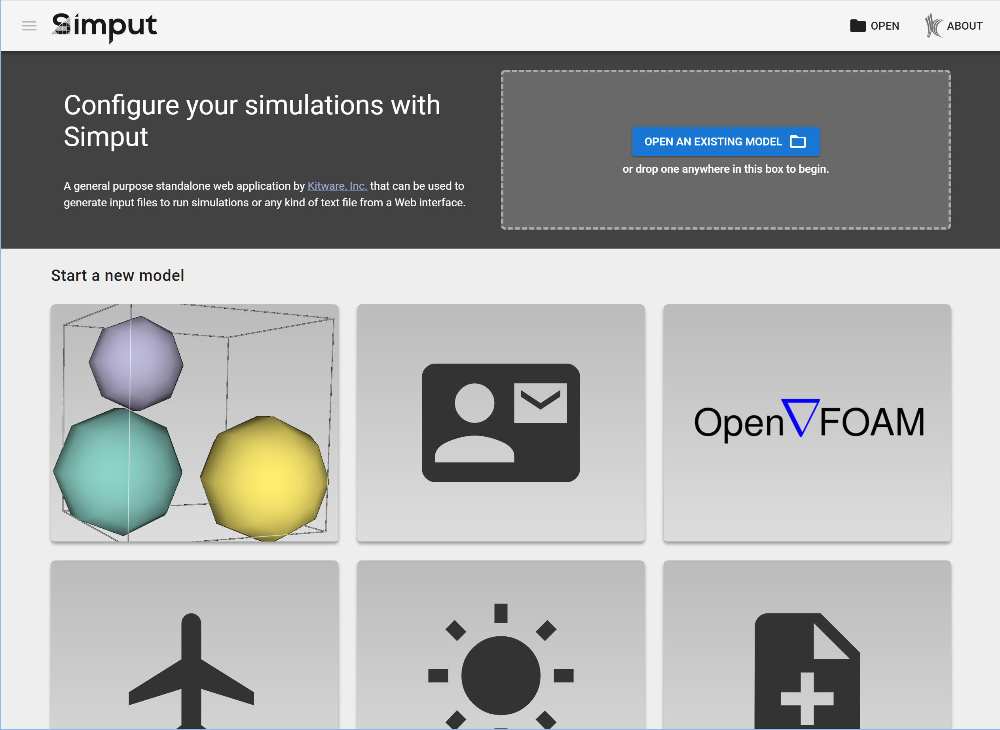

title: Overview
---

Simput is a tool for simplifying the process of writing and editing *simulation* input files.
It can be used as standalone tool or within other platforms such as HPCCloud to streamline input definitions.

## What is Simput?

Simput allows you to specify a data model, and Simput will generate forms for users to fill in. That data will then be turned into a series of text files.

Currently Simput is typically used to create *input-decks* for simulation code while providing an interactive user interface with contextual documentation.

## Usage

```
$ Simput

  Usage: Simput [options]

  Options:

    -V, --version                 output the version number
    -i, --input [file|directory]  Input file or directory
    -o, --output [directory]      Output directory to output to
    -t, --type [type]             Type of input

    -p, --port [8080]             Server port
     (default: 8080)
    -c, --compile [directory]     Directory to compile files
    -m, --minify                  Minify compiled file
    -h, --help                    output usage information
```

Open the Simput landing page locally:

```
$ Simput -p
Simput listening on port 8080
```

Or open the [latest version](http://kitware.github.io/simput/app/) online.



Then you can click on the icon for a type to start editing, or drag a file like [this Pyfr example](https://github.com/Kitware/simput/blob/type-pyfr/samples/2DEulerVortex/model.json) onto the __Open an existing model__ box to start editing it.


## Concept


## Components

In order to create a new input type for Simput you will need:

- __model.json / model.js:__ describe what kind of inputs are needed from the user and how those inputs should be layed out via views.
- __convert.js *[optional]*:__ provide a path to validate and restructure the data model into another one convenient for the template engine and create a target file map (file path / content).
- __templates/\*.hbs *[optional]*:__ Template files to use inside convert.js to actually do the conversion into a file format.
- __lang/en/__
  - __label.json *[optional]*:__ labels to use in the UI for a specific langage such as `en:english`.
  - __help/{Attribute Name}/{Parameter Id} *[optional]*:__ Extended HTML snippets used in togglable help panels for each UI element.

