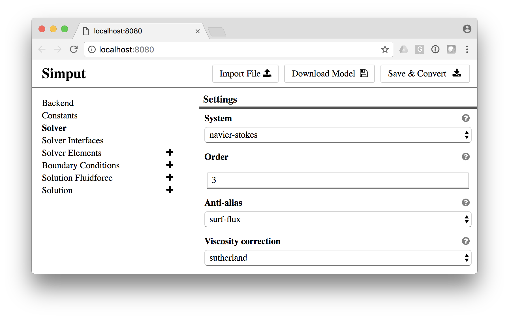

title: Overview
---

Simput is a tool for simplifying the process of writing and editing *simulation* input files. 
It can be used as standalone tool or within other platform such as HPCCloud to streamlining input definition.

## What is SimPut?

SimPut allow you to specify your a data model that will allow to generate UI for users to fill forms that will then be turned into a serie of text files.

The main usage that we have with Simput is to create *Input-deck* for simulation code while providing an interactive user interface with contextual documentation.

## Usage

```
$ Simput

  Usage: Simput [options]

  Options:

    -V, --version                 output the version number
    -i, --input [file|directory]  Input file or directory
    -o, --output [directory]      Output directory to output to
    -t, --type [type]             Type of input
    
    -n, --no-gui                  Just generate output
    -s, --silent                  Do not open the browser
    -p, --port [8080]             Server port
     (default: 8080)
    -c, --compile [directory]     Directory to compile files
    -m, --minify                  Minify compiled file
    -a, --add [file]              Add model to list of available inputs
    -l, --list                    List model types of available as inputs
    -r, --remove [type]           Remove model from list of available inputs
    -h, --help                    output usage information
```

Let's open a specific model locally for edition

```
$ Simput -o /tmp -i types/pyfr/samples/empty/pyfr-empty-externals.json 
Simput listening on port 8080
```



## Concept


## Components

In order to create a new input type for SimPut you will need:

- __model.json / model.js:__ describe what kind of input are needed from the user and how those input should be layout via views.
- __convert.js *[optional]*:__ provide a path to validate and restructure the view data model into another one easier for template engine and create a target file map (file path / content).
- __templates/\*.hbs *[optional]*:__ Template files to use inside convert.js to actually do the conversion into a file format.
- __lang/en/__
  - __label.json *[optional]*:__ Label to use for a specific langage such as `en:english`
  - __help/{Attribute Name}/{Parameter Id} *[optional]*:__ Extended HTML snippet used for togglable help panel

