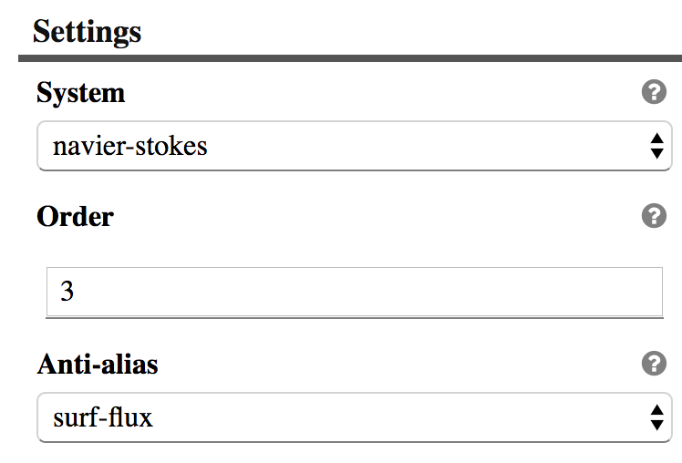
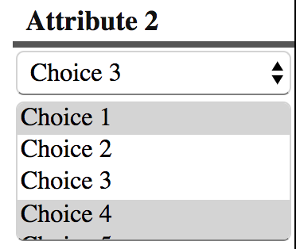
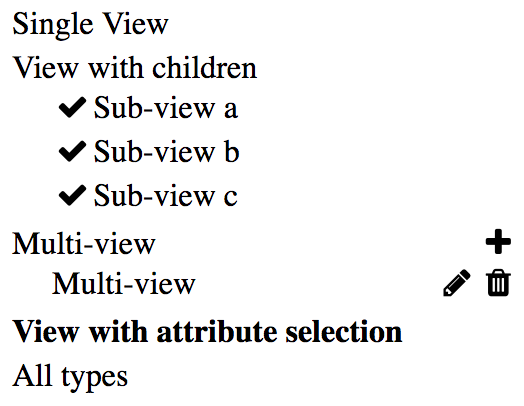

title: Model definition
---

<style>
center.half > img {
  width: 50%;
}
</style>

SimPut works around a model definition that the user have to define initially. The model is used to describe what kind of input are needed from the user and how those input should be layout via views.

## Format

The model can either be a JSON or a JavaScript file. But we recommend to use the JavaScript syntax as it will allow you to use comment and ignore other restriction that JSON is enforcing.

```JavaScript
module.exports = {
  output: {},                                          // optional if no convert.js provided
  defaultActiveView: "NameOfTheViewInOrderToActivate", // Optional
  order: [],                                           // List view names in order for the menu
  views: {},                                           // Views definitions
  definitions: {},                                     // Attributes and parameters definitions
};
```

vs 

```JSON
{
  "output": {},
  "defaultActiveView": "NameOfTheViewInOrderToActivate",
  "order": [],
  "views": {},
  "definitions": {}
}
```

## Model sections

Let's look closer to the various section that can exist inside a `model.[json/js]` file.

### Definitions

The definition is the home of the various attributes that regroup parameters that we want the user to input.
An attribute is defined by a group of parameters with a title. 
Each parameter is listed in an order manner and provide the following set of fields:
- __id:__ Identifiant that is used inside the attribute map within the view model.
- __type:__ ['string', 'double', 'int', 'bool', ...] The type is to properly convert user input from standard UI to their actual type.
- __size:__ Provide how many values are required. -1 usually mean that the size is dynamic.
- __default:__ Provide a default / initial value
- __label *[option]*:__ User friendly label for the parameter name which can be provided within the /lang/ directory.

```
module.exports = {
  definitions: {
    attributeIdentifiant: {
      label: 'User friendly string for the attribute section',
      parameters: [
        {
          id: 'firstname',
          type: 'string',
          size: 1,
          default: 'John',
          label: 'First Name',
        },
        {
          id: 'lastname',
          type: 'string',
          size: 1,
          default: 'Doe',
          label: 'Last Name',
        },
      ],
    },
  },
};
```

<center class="half">

Attribute rendering example
</center>

#### Parameter

##### Layout 

When size is bigger than 1 it make sense to start providing a layout hint. Below we list known layout.

```
"parameters": [
  {
     "id": "a",
     "type": "int",
     "size": 1,
     "default": 0
  },{
     "id": "b",
     "type": "string",
     "size": 2,
     "layout": "2",
     "default": ["x", "y"],
     "show": "a[0] > 5"
  },{
     "id": "c",
     "type": "string",
     "size": 3,
     "layout": "3",
     "default": ["x", "y", "z"]
  },{
     "id": "d",
     "type": "string",
     "size": 4,
     "default": [ "1", "2", "3", "4" ]
  },{
     "id": "e",
     "type": "string",
     "size": 5,
     "default": [ "1", "2", "3", "4", "5" ]
  },{
     "id": "f",
     "type": "string",
     "size": 6,
     "layout": "m6",
     "default": [ "1", "2", "3", "4", "5", "6" ]
  },{
     "id": "g",
     "type": "string",
     "size": 6,
     "layout": "2x3",
     "default": [ "1", "2", "3", "4", "5", "6" ]
  },{
     "id": "h",
     "type": "string",
     "size": 6,
     "layout": "3x2",
     "default": [ "1", "2", "3", "4", "5", "6" ]
  }
]
```

<center class="half">

Attribute rendering example
</center>

##### Show

An additional field can be provided to dynamically show or hide a given parameter based on a neighbor condition.
The value set is always capture within an array, which force the expression to be extracted like shown below.

```
"parameters": [
  {
     "id": "a",
     "type": "int",
     "size": 1,
     "default": 0
  },{
     "id": "b",
     "type": "string",
     "size": 2,
     "layout": "2",
     "default": ["x", "y"],
     "show": "a[0] > 5"
  }
]
```

##### UI

Sometime a single field need to have a custom presentation. A `ui` field is then use to let the user control what *presentation layer* should be used. Below are some existing `ui` implementation:

```
"attr2": {
  "parameters": [
     {
        "id": "a",
        "type": "int",
        "size": 1,
        "ui": "enum",
        "default": [3],
        "domain": {
           "Choice 1": 0,
           "Choice 2": 1,
           "Choice 3": 2,
           "Choice 4": 3,
           "Choice 5": 4
        }
     },{
        "id": "b",
        "type": "int",
        "size": -1,
        "ui": "enum",
        "default": [0,3,4],
        "domain": {
           "Choice 1": 0,
           "Choice 2": 1,
           "Choice 3": 2,
           "Choice 4": 3,
           "Choice 5": 4
        }
     }
  ]
},
```


<center class="half">

Attribute rendering with different ui
</center>

```
{
   "id": "a",
   "type": "bool",
   "size": 2,
   "ui": "checkbox",
   "default": [ true, false ]
}
```

<center class="half">

Attribute rendering with different ui
</center>

The domain in the UI can be filled by some external data. 

```
{
   id: 'fancy',
   propType: 'CustomWidget', // Can be registered dynamically from an external script
   domain: {
      external: 'fieldToEmbedInUIAsDomain',
      dynamic: true, // Optional and only needed if the UI section of that parameter can not be cached
   }
}
```

##### Conditional attributes

Parameters can be dynamically composed based on other attribute parameters and conditional expression.

```
"attrOr": {
   "parameters": [
      {
         "id": "a",
         "type": "int",
         "size": 1,
         "ui": "enum",
         "default": [3],
         "domain": {
            "Choice 1": 1,
            "Choice 2": 2,
            "Choice 3": 3,
            "Choice 4": 4,
            "Choice 5": 5
         },
         "help": ["_self", "attr1", "attr2"]
      },
      [ "attr1", "attr2", "attr3"]
   ],
   "children": {
      "attr1": "attrOr.a[0] >= 1",
      "attr2": "attrOr.a[0] === 2",
      "attr3": "attrOr.a[0] === 3"
   }
},
```

### Views

Views are meant to gather several attribute/parameter into a meaningful pages that get driven based on a side menu.
The label for a view is what will be display in the side menu for selecting a given view/page.
The content of the page will be defined by the __attributes__ array content that was describe above.
When no __attributes__ are given, a __children__ should be used to create a nested list of other views.
The __size__ for a view is used when you want to dynamically create/delete a given view.

```
views : {
   SingleView: {
      label: 'Single View',
      attributes: [ 'attr1' ]
   },
   ViewWithChildren: {
      label: 'View with children',
      children: [ 'SubView1', 'SubView2', 'SubView3' ]
   },
   MultiView: {
      label: 'Multi-view',
      size: -1,
      attributes: [ 'attr1' ]
   },
   ViewWithOr: {
      attributes: [ 'attrOr' ]
   },
   SubView1: {...},
   SubView2: {...},
   SubView3: {...},
},
```


<center class="half">

View menu
</center>

To a view can be attached hooks to dynamically massage the data between transitions. This allow for instance to copy the dynamic view name into a parameter of a given attribute or expose a set of view data into some external domain so they could be used somewhere else in the input definition.

```
views : {
   SingleView: {
      label: 'Single View',
      attributes: [ 'attr1' ],
      hooks: [
        // { type: 'copyViewNameToAttributeParameter', attribute: 'attributeName.parameterId' }, // Type available by default
        { type: 'copyParameterToViewName', attribute: 'attributeName.parameterId' },          // Type available by default
        { type: 'yourCustomHook', ...what-ever-you-want... },                                 // User defined hook dynamically registered
      ],
      readOnly: true,
   },
},
```

Note the `readOnly` option disable the view name edition from the side menu which works well if you want to use a parameter to define that view name.

To register your own hooks, you will have to create a `hooks.js` next to your model file. The following listing illustrate what that file should looks like.

```
function getExternal(dataModel) {
  if (!dataModel.external) {
    dataModel.external = {};
  }
  return dataModel.external;
}

function pushMaterialsToExternalHook(hookConfig, dataModel, currentViewData) {
  const external = getExternal(dataModel);

  // Fill materials
  if (dataModel.data.Materials) {
    const mats = dataModel.data.Materials;
    external.materials = {};
    for (let i = 0; i < mats.length; i++) {
      const name = mats[i].name;
      const currentMaterial = { name };
      // Gather material fields
      Object.keys(mats[i].material).forEach((key) => {
        currentMaterial[key] = mats[i].material[key].value[0];
      });

      // save to external
      external.materials[name] = currentMaterial;
    }
  }
}

function paramToViewName(hookConfig, dataModel, currentViewData) {
  const [attributeName, parameterId] = hookConfig.attribute.split('.');
  currentViewData.name = currentViewData[attributeName][parameterId].value[0];
}

module.exports = function initialize() {
  Simput.registerHook('materialsToExternal', pushMaterialsToExternalHook);
  Simput.registerHook('paramToViewName', paramToViewName);
};

```


### Order

The order is used to define the side menu to provide the list of view in an ordered manner.

```
order: [
   'SingleView',
   'ViewWithChildren',
   'MultiView',
   'ViewWithOr',
   'AllTypes',
],
```

### Output

When a `convert.js` is not provided, additional information can be provided to define what should be generated as output based on the currently defined data model.

```
output: {
  'data.json': { type: 'default' },
  'other.xml': { type: 'template', template: './templates/vera-xml.hbs' },
},
```

Currently only 2 types are available [__default__ or __template__]:
- The __default__ mode is just going to serialize the data model into JSON.
- The __template__ mode allow the user to define a [*Handlebars*](https://handlebarsjs.com/block_helpers.html) template to convert the JSON structure into any other format. 

The output section require additional an additional __output__ field inside each `view` definition.

#### Output inside views

On a view which list a set of *attributes*, you'll need to define an __output__ array that will define a mapping between view attributes into output data model.

Here is an example:

```
output: [
  {
    extract: ['name', 'density', 'thexp', 'fractions'],
    src: 'material',
    dst: [
      'CASEID.CORE.Materials.Material_{name}.name=name',
      'CASEID.CORE.Materials.Material_{name}.density=density',
      'CASEID.CORE.Materials.Material_{name}.thexp=thexp',
      'CASEID.CORE.Materials.Material_{name}.fractions=fractions',
    ],
  },
],
```


Each entry in that output array should be composed of:
- __extract:__ list the parameters that we want to output somewhere in the model.
- __src:__ Name of the attribute that we want to extract the parameters from 
- __dst:__ List of mapping of where to store the given parameters

The left side of the *dst* entry define the path of where a given parameter should be stored which is provided on the right side of the `=`.

When we want to fill an array with object the following pattern can be used:

```
'root.elements[]+=name',
'root.elements.{name}.name=name',
'root.elements.{name}.density=density',
'root.elements.{name}.thexp=thexp',
'root.elements.{name}.fractions=fractions',
```


The `.` on the left side are used as nesting structure inside an object.
The `{xxx}` are automatically replaced on the left side with the actual value of the `xxx` parameter. 


### Scripts

External scripts can be loaded for a given type by providing at the root level a `scripts: [],` section with the list of url that the type should load in order to works.
This can be useful to register custom widgets to edit your custom parameter.
