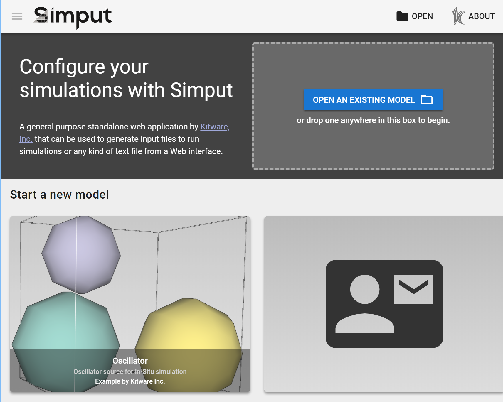
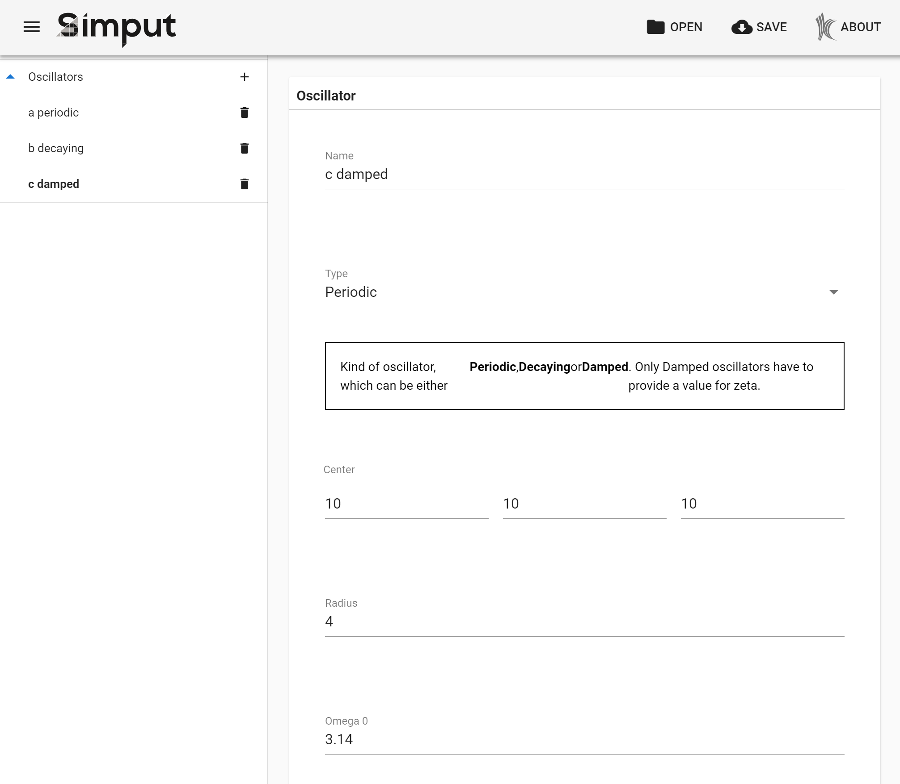

title: Create simulation inputs with Simput
---

<style>
center.half > img {
  width: 50%;
}
</style>

This example is more complete and complex than the simple [vcard example](vcard.html). It includes three output files and the different views to support them. We will walk you through the model definition and its usage inside Simput.

## What's an Oscillator?

We are going to create input files for the [oscillators miniapp](https://gitlab.kitware.com/sensei/sensei/tree/master/miniapps/oscillators), which is part of the [Sensei project](https://gitlab.kitware.com/sensei/sensei). It is designed to emulate the output of a simulation, without actually doing the complicated calculations typical of a simulation. It is used to test the performance of in-situ analysis code, which takes the raw output of a simulation and either visualizes it or performs analysis on it to summarize or compress the results.

The oscillator app takes as input a list of gaussian oscillators with a few parameters that tell their position, size, and how they vary over time. The contents of an input file might look like this:

```
# type      center      r       omega0      zeta
damped      32 32 32    12.5    3.14        0.3
damped      48 32 48    5       3.14        0.1
decaying    16 32 48    15      3.14
periodic    16 32 16    10      9.5
periodic    48 32 16    15      3.14
```

We will also create two other input files. The first is an xml specification of a list of analyses to perform on the simulation output. The second is a script file to run the oscillator in a multi-process context with the other two input files. We'll get back to those other files later on.

## Creation of the new type

### Setup

First we need to create a directory for our files. After [cloning simput](develop_requirement.html) and running `npm install`, create the directories `types/oscillator/src`, and the file `types/oscillator/README.md` to document our type.

Next we add a line to `package.json` to compile our type:
```js
  "scripts": {
    // ...
    "type:oscillator": "node ./src/cli/simput-cli.js -c ./types/oscillator/src -o ./static/types -t oscillator",
```

Finally we add our type to the landing page. In `static/index.html`:
```
      // Register various template
      Simput.registerType('demo', ['./types/demo.js']);
      // add to list:
      Simput.registerType('oscillator', ['./types/oscillator.js']);
```

and in `src/samples/index.js`:
```
  {
    label: 'Oscillator',
    image: Images.oscillator,
    // icon: 'wb_sunny', // or start with an icon
    description: 'Oscillator source for In-Situ simulation',
    acknowledgement: 'Example by Kitware Inc.',
    model: {
      type: 'oscillator',
      data: {},
    },
  },
```
We added an image in the `images` subdirectory, but an icon from `vuetify` can be used instead.

### Model creation

Let's create a View to contain our list of gaussian oscillators. The is specified as a json or javascript object, though we recommend javascript because it can contain comments. Our __data model__ needs an entry for each of the gaussian's parameters, and the variable-sized list to contain them. Create the file `types/oscillator/src/model.js`:

```model.js
module.exports = {
  order: ['oscillators'],
  views: {
    oscillators: {
      size: -1,
      attributes: ['oscillator'],
      hooks: [
        {
          type: 'copyParameterToViewName',
          attribute: 'oscillator.name',
        },
      ],
    },
  },
  definitions: {
    oscillator: {
      parameters: [
        {
          id: 'name',
          label: 'Name',
          type: 'string',
          size: 1,
        },
        {
          id: 'type',
          type: 'enum',
          size: 1,
          default: 'periodic',
          domain: {
            Periodic: 'periodic',
            Decaying: 'decaying',
            Damped: 'damped',
          },
        },
        {
          id: 'center',
          type: 'int',
          size: 3,
          layout: '3',
          default: [0, 0, 0],
        },
        {
          id: 'radius',
          type: 'double',
          size: 1,
          default: [1],
        },
        {
          id: 'omega0',
          type: 'double',
          size: 1,
          default: [1],
        },
        {
          id: 'zeta',
          type: 'double',
          size: 1,
          show: "type[0] === 'damped'",
        },
      ],
    },
  },
};
```

This model definition will be automatically displayed as a form for the user to fill out, with add and delete buttons for changing the list of oscillators.

These parameters illustrate some of the different types and options available. Parameter types can be `double`, `int`, `string`, `enum`, or `bool`. Parameters like `center` with a `size` greater than 1 can choose different layouts. The `zeta` parameter doesn't have a default value, so it is only defined if the user fills it in. It also is only visible depending on the value of the `type` parameter.

### Template file

Template files define our output - the files we produce for input to the simulation. The oscillator list is very simple, with a single line per oscillator. Here, we just loop over lines and output them, using triple-curly-brace to signal a variable substitution. Several kinds of looping and conditionals are available inside a [Handlebars template](https://handlebarsjs.com/), which we'll see later.

```templates/oscillator_list.hbs
{{#each lines}}
{{line}}
{{/each}}
```

### Convert function

How do we get from our model and the input from the user, to the list of lines needed by our template? This is the job of the convert function. Let's take a look:

```convert.js
const outputTemplate = require('./oscillator_list.hbs');

const COLUMN_SPACING = 5;

module.exports = function convert(dataModel) {
  const results = {};
  // Start with a standard header
  const lines = [['# type  ', 'center  ', 'r  ', 'omega0  ', 'zeta']];

  dataModel.data.oscillators.forEach((attributes) => {
    const oscillator = {};
    Object.keys(attributes.oscillator).forEach((fieldName) => {
      const value = attributes.oscillator[fieldName].value;
      if (value.length === 1) {
        oscillator[fieldName] = value[0];
      } else {
        oscillator[fieldName] = value;
      }
    });
    console.log(oscillator);
    lines.push([
      `${oscillator.type}`,
      `${oscillator.center[0]} ${oscillator.center[1]} ${oscillator.center[2]}`,
      `${oscillator.radius}`,
      `${oscillator.omega0}`,
      `${oscillator.zeta || ''}`,
    ]);
  });

  // Compute max size of each column
  const sizes = [0, 0, 0, 0, 0];
  for (let lineIdx = 0; lineIdx < lines.length; lineIdx++) {
    const line = lines[lineIdx];
    for (let tokenIdx = 0; tokenIdx < line.length; tokenIdx++) {
      sizes[tokenIdx] = Math.max(sizes[tokenIdx], line[tokenIdx].length);
    }
  }

  // Add padding to align columns
  for (let lineIdx = 0; lineIdx < lines.length; lineIdx++) {
    const line = lines[lineIdx];
    for (let tokenIdx = 0; tokenIdx < line.length; tokenIdx++) {
      while (line[tokenIdx].length < sizes[tokenIdx] + COLUMN_SPACING) {
        line[tokenIdx] += ' ';
      }
    }
    // collapse tokens
    lines[lineIdx] = { line: lines[lineIdx].join('') };
  }

  // Use dummy line writer
  results['oscillator_list.osc'] = outputTemplate({ lines });

  return { results, model: dataModel };
};
```

The conversion actually happens in the first loop, where the objects from the data model have their `value` fields extracted and put into a list in the correct order. Two more loops calculate lengths and add padding to make columns line up nicely. Finally, this statement: `lines[lineIdx] = { line: lines[lineIdx].join('') };` converts to a list of objects with the key `line`, which is used in the template as `{{line}}`.

## Compilation of new type

If you clone the repository and ran `npm install` during setup, you should be able to run:

```
$ npm run type:oscillator
```

to compile the new type, and in a separate window

```
$ npm run dev
```

to compile Simput and start a development server.

## Fill in your data

Open http://localhost:9999 in your browser.

<center class="half">

Landing page
</center>

Click the `oscillator` card.

<center class="half">

Initial empty page / content
</center>

Start filling it...

<center class="half">

Add some oscillators
</center>

Then press the `Save` button.

A zip file is written, which contains `oscillator_list.osc` along with the data model.

If you restart Simput and drag-and-drop this zip file onto the `Open an existing model` box, you will find all the information you've entered.


